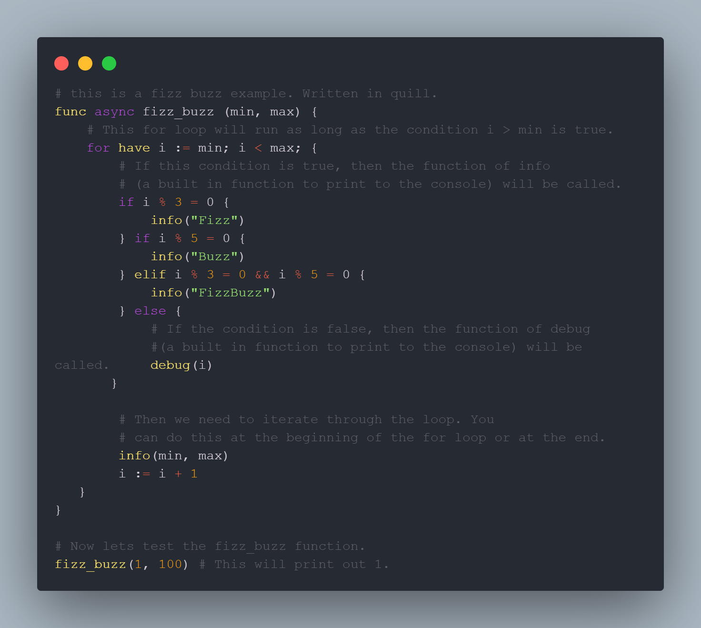
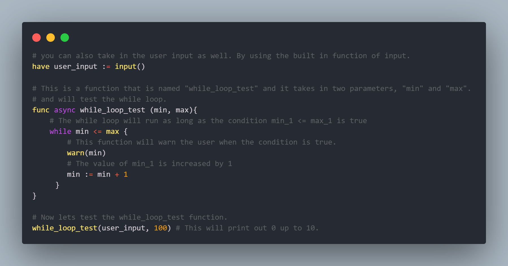
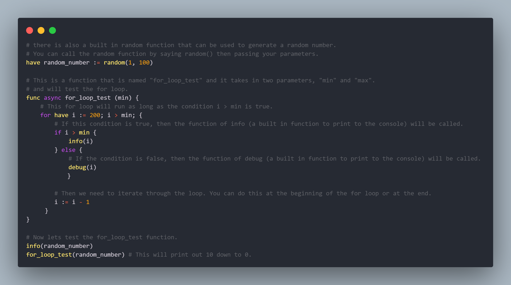
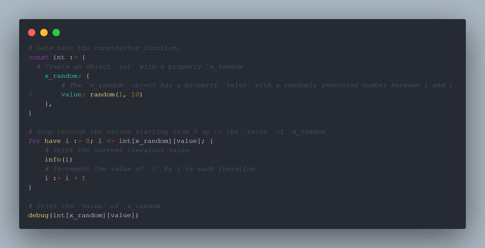

# Quill Language


Quill is a high-level, dynamically typed, and interpreted programming language designed to be easy to learn and use. It features a syntax that is simple and intuitive, making it a great choice for beginners. Quill supports many of the common programming constructs such as variables, control structures, and functions, and provides a rich standard library for tasks such as string manipulation, file input/output, and more. Quill also supports arrays, which are ordered collections of values of the same type, and can be used to store and manipulate large amounts of data. The Quill interpreter provides a REPL (Read-Eval-Print Loop), making it easy to test code snippets and see the results immediately. Additionally, Quill provides good error messages and debugging facilities, making it easy to fix any issues in your code. Overall, Quill is a great choice for anyone looking for a simple, yet powerful programming language.

Here is our [Discord Server](https://discord.gg/JvExQpGuXM)!

Quill runs on Deno, a better JS runtime. Plan on making our on QVM (Quill Virtual Machine) in the future.

# Using Quill

Clone the repository

```shell
git clone https://github.com/TheDevConnor/Quill --recurse-submodules
cd Quill/Quill
```

You can then use Deno (NodeJS is untested) to run:

```shell
./run --allow-env --allow-read
# Can someone on linux test this?
```

# Here is a simple example of a Quill program:



Example 2:



Example 3:



Example 4:



## Acknowledgements

- [Typescript](https://github.com/microsoft/TypeScript)
- [DenoJS](https://deno.land/)
- [How to write a Good readme](https://bulldogjob.com/news/449-how-to-write-a-good-readme-for-your-github-project)
